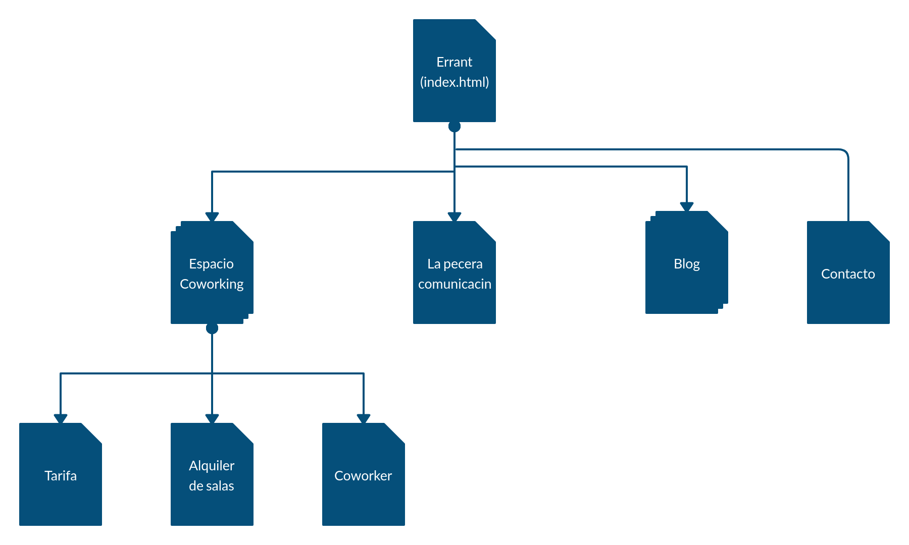
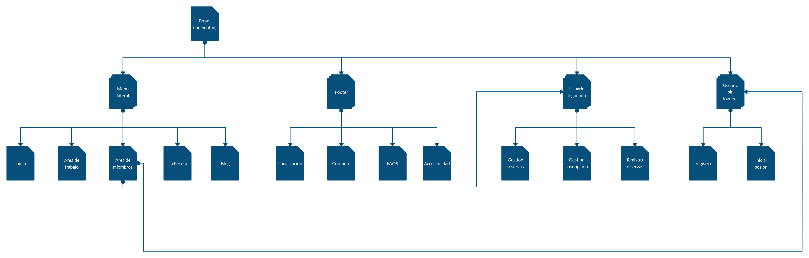
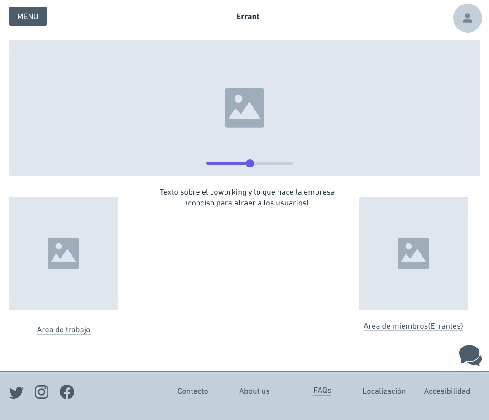
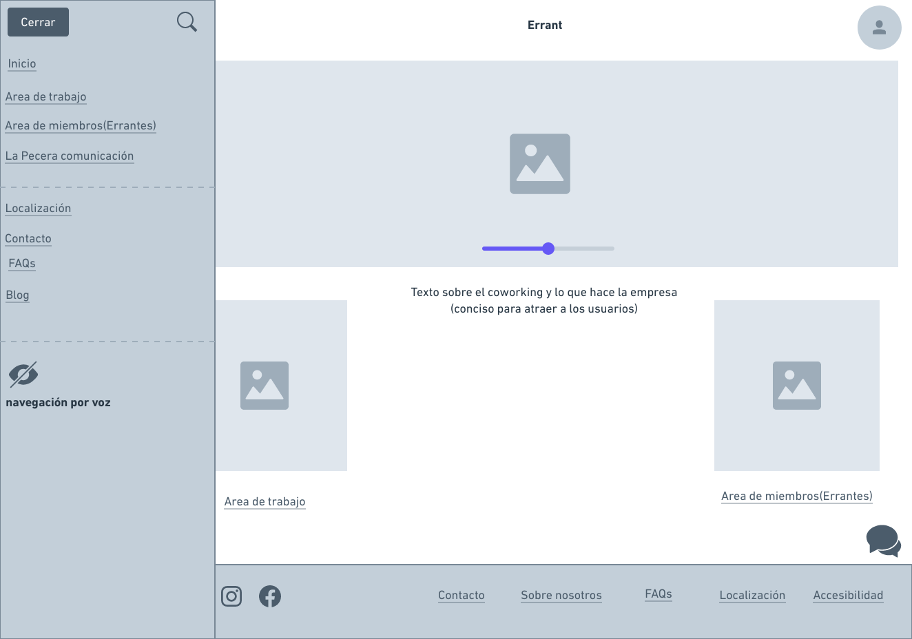
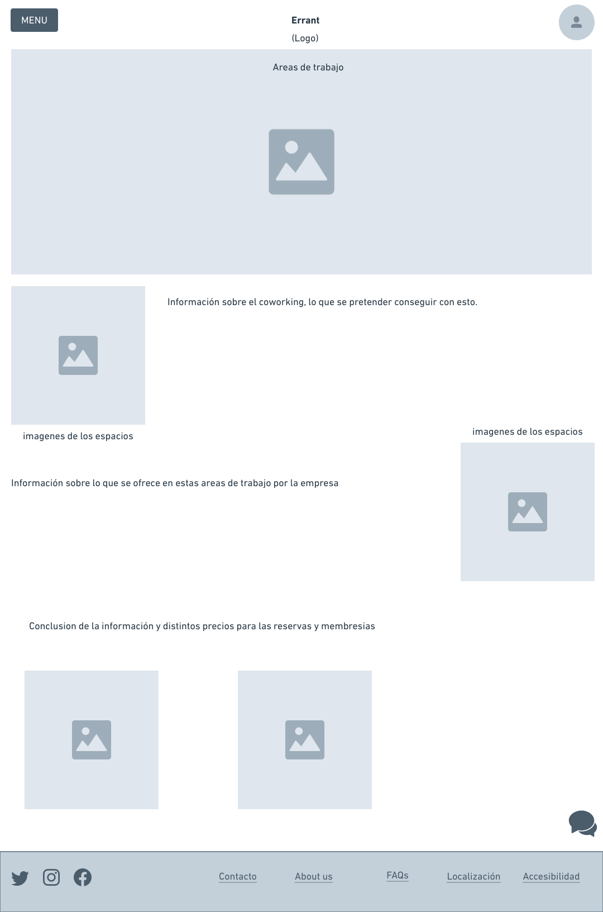
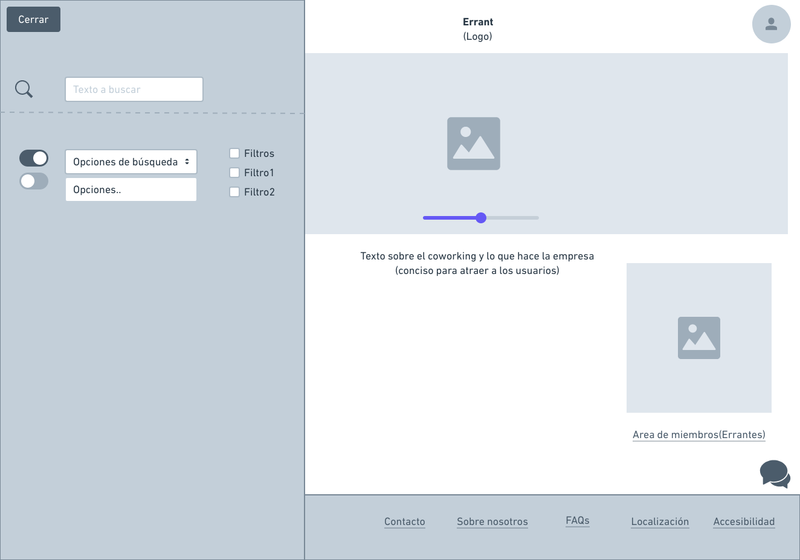
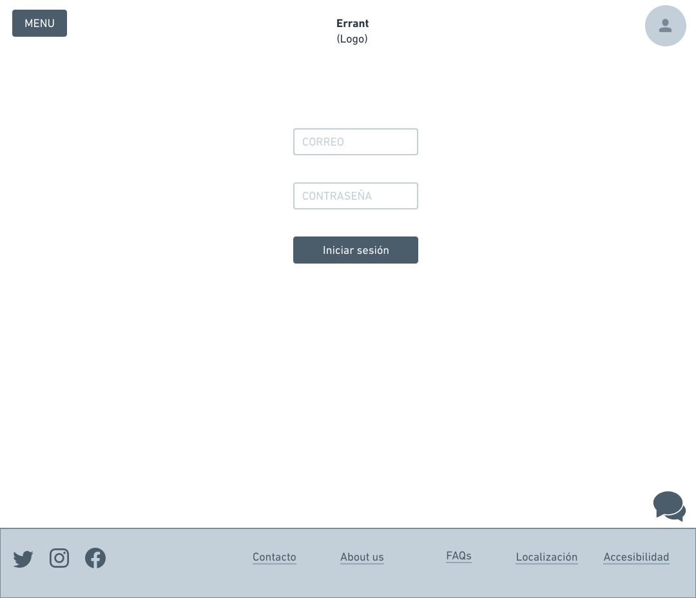
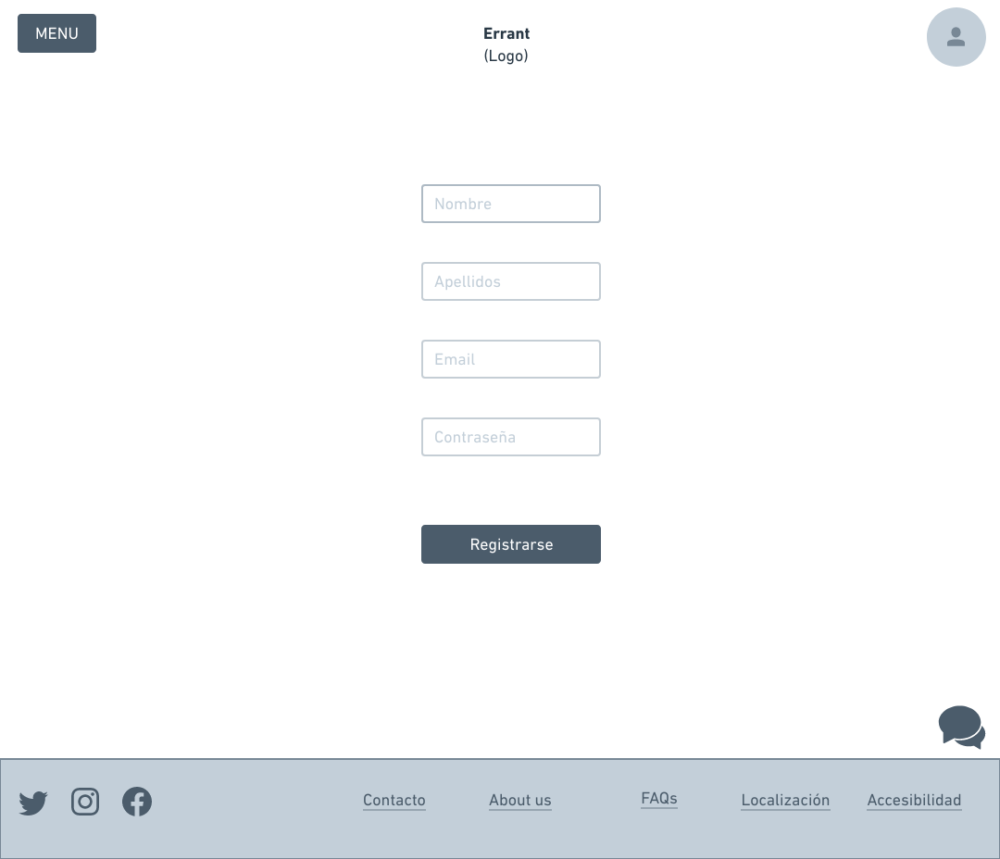
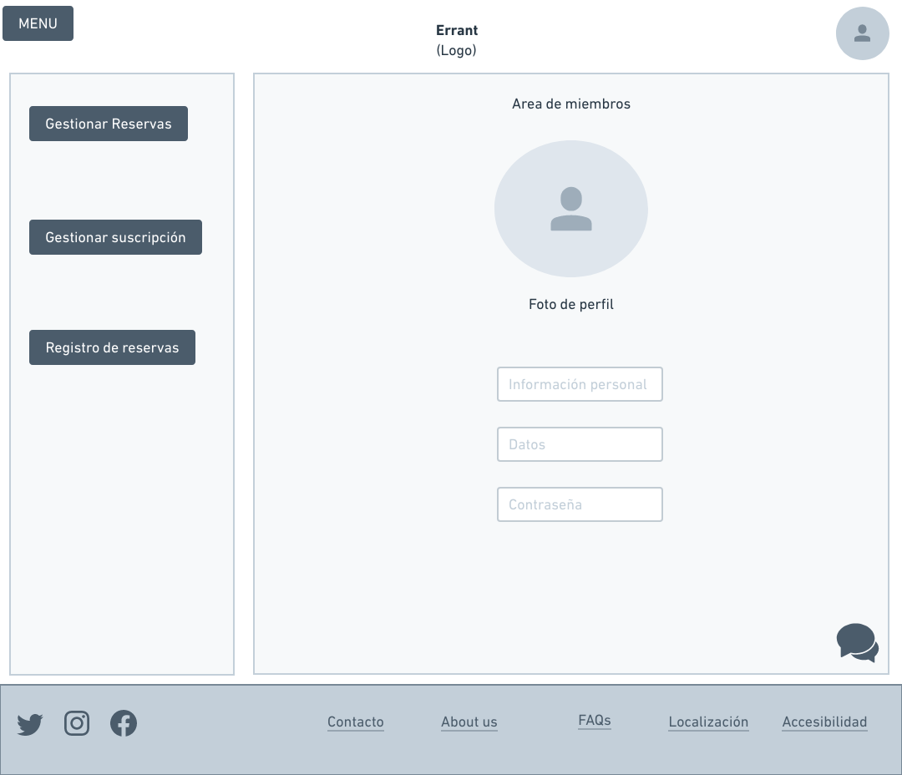
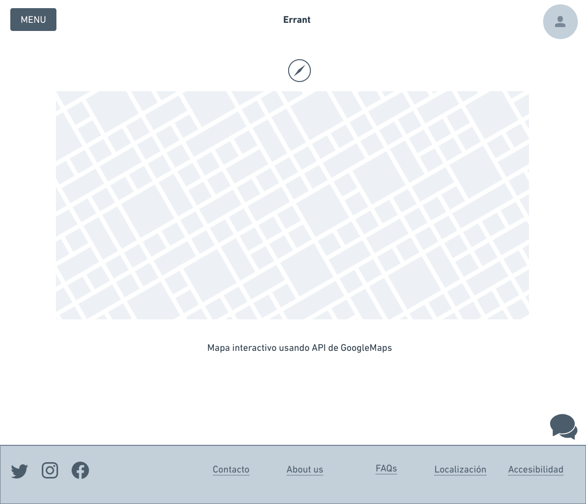

# Ejercicio Final DIU20 ~ José Santos Salvador
* **Descripción:** Se va a realizar un (re)diseño de una web para una empresa de coworking, aplicando técnicas y metodologías de diseño centrado en un usuario y UX a un caso real.

* **Caso de estudio:** Este rediseño se va a hacer sobre Errant ya que en dicha página hay numerosos puntos de los que hablar y es la que más potencial de mejora tiene. El rediseño de UX se centrará en el analisis de sus problemas o desconexiones entre usuarios y su objetivo final y en la nueva solución a estos problemas mediante un rediseño.

## Problemas y analisis

Errant es empresa de coworking en Granada, el coworking se basa en una filosofía de trabajo por la cual se comparten espacios para desarrollar proyectos. Permiten generar espacios con afluencía de personas que puedan desembocar en nuevas relaciones , dando lugar a espacios no solo de trabajo, si no de gran creatividad y nuevas ideas.  
Errant además de proporcionar servicios de coworking, también proporciona la posiblidad de crear tu proyecto visual (la pecera comunicación).

### Analisis competitivo
En su ámbito de mercado nos encontramos propuestas como:
* *Cubitake* : Añade además la posibilidad de hablar con un bot para más información y obtener un servicio de oficina virtual respecto a Errant.
* *CoFamily Coworking*: Esta propuesta rompe un poco con las bases del coworking y amdeás añade a su objetivo, el trabajo cooperativo junto con el cuidado de tu bebé, todo en un mismo lugar.
* *AndaCowork*: Mantiene una propuesta muy similar a Errant

### Usability-Review
Para el analisis de usabilidad, se ha centrado en la búsqueda de errores u objetivos que no se cumplen por parte de futuros usuarios. No se ha realizado la creación de personas ficticias para este proposito, ya que se consdiera más importante en un primer vistazo, identificar los posibles problemas y desarrollar soluciones a estos. Durante el analisis de usabilidad, se ha calificado la página con un 6 sobre 10.   
 
Los **principales problemas** de la página los encontramos es su corta funcionalidad y es que la página unicamente sirve como expositor de lo que se hace y publicidad, unicamente se puede consultar información (precios, localización, etc) y enviar formularios. Además de exponer La pecera como algo principal, cuando unicamente es información, pudiendo confundir a los usuarios.      
No te permite hacer ninguna reserva mediante la página, ni iniciar sesión si eres Errante o consultas relacionadas con la sesión del usuario y la gestión de errores es inexistente o nefasta (meter el erro directamente al html sin ningun tipo de formato con CSS).     
La localización del sitio es una imagen añadidoa al html, sin hacer uso de ninguna API como la de GoogleMaps. Si cliclas en 'espacio coworking granada' del menú principal, sin seleccionar una subopción te genera un error dentro del HTML 
        
        ( Warning: Use of undefined constant PP_SETTINGS_TYPE - assumed 'PP_SETTINGS_TYPE' (this will throw an Error in a future version of PHP) in /homepages/12/d578519675/htdocs/wp-content/plugins/panopress/panopress.php on line 626) 
        
mostrando posible información sensible. La ayuda en linea se resume en formularios, no hay sección de preguntas frecuentes o uso de un bot en linea (como algunas de las empresas de su sector).          
También se reitira la parte de contacto, en la página de inicio al final y en la sección de contacto quizás hubiese sido mejor dejar en la sección principal, un area de información o que muestre algo ilustrativo de las instalaciones.   
Y uno de los principales problemas es lo confuso de su navegación por menús y su posicionamiento

[Usability Review ~ xlsx](https://github.com/thejosess/DIU20_EjercicioFinal/blob/master/UX.xlsx)  
 
[Usability Review ~ PDF](https://github.com/thejosess/DIU20_EjercicioFinal/blob/master/UX.pdf)  

### Accesiblidad
Adicionalmente y para analizar los problemas de accesibilidad se ha hecho uso de extensiones como  accessibbility insights for web, WAVE Web Accesibility Evaluation Tool, Web Disability Simulator y AXE. 
La página no tiene ninguna sección de información sobre accesibilidad, tiene errores de contraste con los enlaces, los formulario no tienen etiquetas correspondientes, varios elementos tienen id iguales, el encabezado debe incrementarse para una mayor visibilidad para personas con discapacidades y no permite el zoom la página ("maximum-scale en la etiqueta <meta> impide el zum en dispositivos móviles").     
En cuanto al soporte de otros idiomas, al cambiar al inglés, ocurren algunos errores y las entradas del blog no están traducidas.

        formats not supported oir souces not found

 y no termina de ser una conversión correcta para su uso.

### Labeling que usan
El labeling de la página deja claro que no existe ningún footer (salvo lo que habla de WordPress y que es usado para la página) y hasta las redes sociales están dentro del body de la página.

## Rediseño UX

### Feedback Captura Grid
Se ha llevado a cabo mediante el feedback obtenido por personas reales que han provado la página.

| Interesante/Relevante | Criticas constructivas|
| ------------- | ------------- |
| Información clara y esclarecedora | Añadir más información sobre la Pecera comunicación |
| Interfaz sencilla y concisa | Mejorar la información sobre que es el coworking |
|Rendimiento correcto| Añadir un buen soporte para otros idiomas |

| Preguntas a raiz de la experiencia | Nuevas ideas |
| ------------- | ------------- |
| ¿Se pueden filtrar las búsquedas? | Añadir un mapa interaccitvo sobre el lugar de las oficinas |
|¿Puede hacer reservas desde la página web? | Permitir las reservas online  | Proporcionar una sección de FAQs |
|¿Puede gestionar mis cosas de Errante desde la web?|Añadir un area de errante |
| |Añadir un footer mejorado y con información de accesiblidad|
| |Ofrecer un bot para ayudar a los usuarios con sus preguntas |

**Propuesta de valor**   
La propuesta de valor que se va a diseñar a continuación trata de solucionar los problemas ya comentandos, mejorar la navegación por los menús (secciones en menús con información relevante y distintas al resto de opciones para diferenciarlas), reorganización del labeling de la página, implementación de un area de clientes, permitiendo realizar reservas, adición de un bot, una sección FAQs y un footer para aummentar la información con los usuarios. Así como la creación de un mapa interactivo para localizar las oficinas. Y mayores posibilidades en el tema de búsquedas con opciones de filtro. 
En cuanto a la accesiblidad, se usaran un mayor contraste de colores para una mayor visiblidad, así como un opción de navegación por voz.
 
Todo ello con objeto de facilitar el uso a los clientes y permitiendo utilizar la página no solo como una forma de publicitar los servicios de la empresa, si no como una forma de interactuar con los clientes y los errantes.   
Se dejará de lado Wordpress (una migración del servicio para su mejora y que a la larga repercutirá en beneficios a la empresa) y se basará en PWAs.

### Nuevo Labeling

Término | Significado     
| ------------- | -------
|  **Inicio**  |Te dirige a la página principal (index.html)
|  **Buscador**  | Realiza una búsqueda sobre la base datos con la información introducida y permitiendo filtrar
|  **Area personal**  | Area para la gestión de los miembros (Errantes)
|  **Area trabajo**  | Area para ver los espacios de trabajo, información, características y precio
| **Gestion reservas** | Sección en la que gestionar las reservas realizadas y pagos 
| **Gestion suscripción** | Sección en la que gestionar el tipo de suscripción a Errant, pùdiendo cancelarla, renovarla o cambiarla.
| **Registro de reservas**| Aqui se pueden ver las reservas realizadas y sus facturas
|  **Contacto**  | Contacto directo con el servicio de atención al cliente
|  **Bot**  | Bot online para hablar sobre dudas o información relativa a la empresa
|  **Usuario**  | El icono usuario, te lleva a la ventana para registrarse, iniciar sesión o para ver el área personal

 

### Wireframes
Con estos Wireframes se tratará de mostrar al cliente el nuevo rediseño y como podría acabar.   
La página principal (index.html) se centrará en mostrar más imagenes con un expositor y menos información, para mostrar las instalaciones a los usuarios y convencerlos, permitiendo mediante enlaces ampliar dicha información ('leer más',con gran constraste).   
Se relega a un "segundo plano" la pecera y se pone dentro del menú desplegable ya que podría distraer y confundir a los usuarios por primera vez.  
Luego a la izquierda se tendría un menú lateral para no acaparar la información de estas imagenes principales. Tras abrirlo se centraría la atención en este menú que se expande y deja un poco más apagado el fondo que tiene (en este caso las páginas principales), mostrando las distintas opciones del mismo.   
En el footer nos encontraremos con las distintas redes sociales, enlace a las FAQS y el contacto y enlace a la accesibilidad. Durante la navegación, hay un icono de un mensaje que al pulsar se abre un bot en linea para preguntas. También se muestra en el menú una opción para la navegación por voz.   
En la parte superior derecha se encuentra el icono del avatar, donde al pulsarlo te permite iniciar sesión o registrarse, para poder acceder al area personal.

página principal

 
 
desplegando menú lateral

 
 
area de trabajo

 
 
búsqueda

 
 
inicio de sesión

 
 
registro

 
 
area personal

 
 
mapa interactivo

 
 

No se han realizado todas las páginas, ya que o bien son muy sencillas y no es necesario de crear o las que utilizaba la página original eran correctas. Cabe añadir que la pecera comunicación  habría que remodelarla y aunque se mantiene ese sección donde mostrar proyectos ya realizados (una forma correcta de mostrar lo que se ha hecho), también habría que añadir las herramientas de las que se disponene y mas información para posibles futuros clientes.   
Todos los elementos de los bocetos subrayados, son enlaces a otras secciones de la página.

### Guidelines
En cuanto a la guía de diseño se ha basado en esta referencía [1] y para el rediseño como se ha podido ver, se ha simplificado la página por completo para mostrar principalmente imagenes de las areas de trabajos (en la página principal) o imagenes que ilustren dicha sección (imagenes asociadas de cada una) y centrandose en captar la atención del usuario con una idea simple y concreta; el coworking. Luego se tiene un menú lateral para mayor información pero dejando así limpia la página en la que se está.    
Todo este desarrollo se sustenta en el principio de creación de la página mediante la filosofía de Progressive Web Apps (dejando Wordpress) para obtener un mayor control y la capacidad de aunar lo mejor de dos sectores como es el de las páginas webs y las aplicaciones (aumentando el sector de actuación).   
Para ello es necesario trabajar sobre los requisitos del modelo RAIL introducido por Google:
* Respuesta
* Animación
* Inhabilitado
* Carga  
En resumen, una PWA tiene que responder a la solicitud del usuario (permitir funcionar sin conexión), mostrar una animación para mantenerlo en espsera, almacenar en caché el contenido que sea posible y cargar en menos de un segundo.
 
     

    

(producir 60 fps y cada fotograma tiene que pasar por estos pasos)
   

Además de lo comentando se usará material-UI para implementar material desing de google en la web (que tanto gusta a los usuarios). Así como Paymente request API para efectuar los pagos desde la web.    
Todo esto ayudaría a solucionar algunos problemas de accesibilidad (el zoom, contraste, etiquetado, etc) y junto al modo de navegación por voz incrementaría la accesibilidad de la página. 

## Conclusiones
Este sería el analisis y el rediseño que propongo a Errant para su página web. Hay que tener en cuenta que esto es un primer vistazo, para la realización del rediseño por completo sería necesario hablar con la parte interesada (la empresa) y poder ultimar todo, así como partes importantes de la implementación que se han omitdo.

Biografía

[1]:https://52weeksofux.com/

https://uxdesign.cc/the-new-york-times-timely-app-concept-27efe88e5d4b  
https://uxdesign.cc/redesigning-a-sleep-and-activity-trackers-e-commerce-page-a-ux-case-study-1f1c5b2a8955  
https://uxdesign.cc/ux-ui-case-study-atlanta-jugglers-association-site-redesign-90b422d9dba4   
https://uxdesign.cc/ux-case-studies/home  
